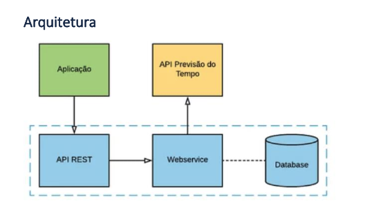

# API Clima Tempo

Experiência com um crud usando flask e suas ferramentas

- Flask
- flask_sqlalchemy
- flask_migrate
- flask_marshmallow
- marshmallow_sqlalchemy

# Início - Descrição e Pré-Requisitos

## Pré-requisitos
* O teste deve ser escrito em linguagem Python 3;
* Utilizar o framework Flask(As demais bibliotecas e frameworks utilizados para resolução do problema são de livre escolha do candidato.);
* Executar o sistema em ambiente local;
* Banco de dados SQLite.
* Presença do requirements.txt para instalação de dependências
  
## Diferenciais
* Boas práticas de programação (seguir as convenções das linguagens e paradigmas utilizados).
* Cobertura de testes unitários
* Dockerfile que simplifique a execução do teste

## Contexto

* Implementar um webservice que utilize um serviço de previsão do tempo (http://apiadvisor.climatempo.com.br/doc/index.html#api-Forecast-Forecast15DaysByCity), e persista os dados no banco de dados relacional (SQLite). O backend deve fornecer ainda uma interface para consumo externo (API RESTful).

## Arquitetura

  
## Regras do Negócio
```
1 - O webservice receberá, através de uma interface REST, uma requisição da aplicação com o id de uma cidade como parâmetro;
    a. Ex: localhost:5000/cidade?id=<ID_DA_CIDADE>
```
```
2 - O webservice faz uma requisição à API do serviço de previsão do tempo, enviando os parâmetros id e token;
    a. Ex: http://apiadvisor.climatempo.com.br/api/v1/forecast/locale/<ID_DA_CIDADE>/days/15?token=<TOKEN>
    b. O token a ser utilizado é o b22460a8b91ac5f1d48f5b7029891b53
```
```
3 - Persistir no banco de dados os campos (obtidos na resposta da requisição):
    a. Nome da cidade, estado, país, data, dados de chuva (probabilidade e precipitação) e o campos min e max de temperatura.
    b. A modelagem do banco é de livre escolha do usuário.
```
```
4 - Implementar uma nova ação que recebe os parâmetros data_inicial e data_final e, consultando no banco de dados, calcula e retorna, no formato JSON, os seguintes valores dentro do período especificado: Ex: localhost:5000/analise?data_inicial=<DATA_INICIAL>&data_final=<DATA_FINAL>
    i. A cidade que possui a maior temperatura máxima.
    ii. Média de precipitação por cidade (todas as cidades que foram consultadas).
```


## Instalando o projeto e dependências
A seguir um passo a passo para a instalação do sistema e suas dependências

* clone o projeto:
```
git clone https://github.com/diegocostacmp/onovolab-flask
```
* Certifique-se de que o Python e o Ambiente Virtual (venv) estejam instalados.
Crie o ambiente virtual e instale os pacotes.
 ```
 cd onovolab-flask
 virtualenv venv
 source venv/bin/activate (Windows: venv\Scripts\activate)
 pip install -r requirements.txt
```
## Como rodar esse projeto

``` 
Execute: ./start.sh (talvez seja necessário dar permissão de execução: chmod +x start.sh)
```

## Como fazer as migrações

```sh
flask db init
flask db migrate
flask db upgrade
```


## Como rodar os endpoints

```
# enpoint que busca a cidade e grava suas informações no banco de dados sqlite(é necessario escolher o lugar onde o banco sera criado, caso queira ver as infomações via database)
Exemplo: http://127.0.0.1:5000/cidade/3477
```
```
# Endpoint que mostra cidade com maior temperatura maxima(item-i) e media de precipitação por cidade(item-ii)
# O formato de data esperado é 00-00-0000, indicado respectivamente: dia-mes-ano.
    Exemplo: http://127.0.0.1:5000/analise/06-02-2020/7-02-2020/
```

## Construido com

* [Python](https://www.python.org/) - Linguagem de programação
* [Flask](https://flask.palletsprojects.com/en/1.1.x/) - Micro-Framework Python


## Autor

* **Diego B B Costa** - *Trabalho inicial* - [Ver...****](https://github.com/diegocostacmp)

## Licenca

This project is licensed under the MIT License.